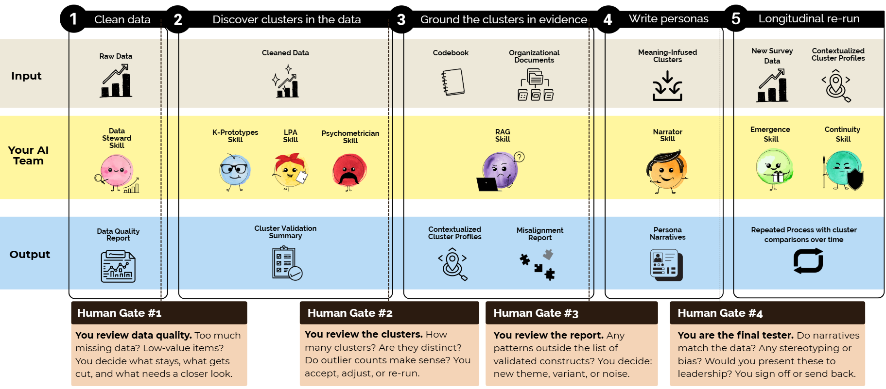

# Human-Centered Personas at Scale

**Using LLMs and RAG to Build Personas from Mixed-Methods Data**

SIOP 2026 Master Tutorial | New Orleans, LA | April 30, 2026

Chelsea Wymer | Diana Wolfe | Alice Choe

> **Citation:** Wymer, C., Wolfe, D., & Choe, A. (2026, April 30). *Human-Centered Personas at Scale: Building LLM-Based Personas Using Mixed Methods Data* [Master Tutorial]. Society for Industrial and Organizational Psychology Annual Conference, New Orleans, LA, United States.

---

## The Problem

Every organization facing disruption collects enormous volumes of employee feedback. Pulse surveys return thousands of Likert-scale responses and open-ended comments. HRIS systems hold demographic and role data. Leadership is asking the same question everywhere: *Who are our people right now, and what do they need?*

Traditional qualitative methods produce rich, valid personas, but they cannot scale to thousands of respondents. Simple text analytics can scale, but they sacrifice construct validity in the process. This tutorial demonstrates a third path: **a reproducible pipeline that uses AI language models, statistical clustering, and grounded organizational documents to build personas that are simultaneously scalable, rigorous, and human-centered.**

---

## The Approach

The pipeline has four phases, each followed by a human decision gate where the I-O psychologist reviews results before anything moves forward. Nine specialized AI agents handle distinct analytical tasks. The agents do the computation. You make the judgments.



### Phase 1: Ingest and Clean

The **Data Steward** screens raw survey data using the Survey Data Quality Evaluation Model (Papp et al., 2026). Five sequential quality gates -- schema validation, careless responding detection (multi-hurdle; Curran, 2016), sparsity checks, variance gates, and distribution screening -- produce a clean dataset with a full audit trail of what was removed and why.

**Gate 1:** You review the data quality report. Are the removal rates acceptable? Were any demographic groups disproportionately affected?

### Phase 2: Discover Workforce Segments

Two independent clustering methods run simultaneously to challenge each other:

- **K-Prototypes** (Huang, 1998) groups people using both demographics and survey scores. It answers: *Who are these people?*
- **Latent Profile Analysis** via Gaussian Mixture Models groups people using survey scores only, ignoring demographics. It answers: *What psychological profiles exist?*

The **Psychometrician** then validates both solutions. Silhouette scores (Rousseeuw, 1987) measure cluster separation. The Adjusted Rand Index (Hubert & Arabie, 1985) measures how much the two methods agree on which respondents belong together, corrected for chance. Agreement means high confidence. Disagreement means demographics and psychology tell different stories -- which is itself an informative finding.

**Gate 2:** You review the cluster validation summary. How many segments? Are outliers being treated fairly?

### Phase 3: Ground in Organizational Reality

Clusters are statistical abstractions. To become useful personas, they must be grounded in organizational context.

The **RAG Agent** builds a searchable knowledge base from organizational documents (policy memos, restructuring announcements, benefits updates, team charters) and retrieves passages relevant to each construct. The **Emergence Agent** scans cluster profiles for patterns outside the 12 codebook constructs, classifying each candidate as NEW, VARIANT, or NOISE (Glaser & Strauss, 2017; Braun & Clarke, 2006).

**Gate 3:** You review the emergent theme report. Should any new themes be added to the codebook?

### Phase 4: Write and Validate Personas

The **Narrator Agent** synthesizes cluster profiles, psychological fingerprints, and policy context into evidence-grounded persona narratives. Every claim must trace to centroid values or retrieved passages. The epistemic risk mitigation protocol (Nguyen & Welch, 2025) prevents anthropomorphic interpretation, fabricated quotations, and the Oracle Effect.

**Gate 4:** You approve the personas for leadership presentation. Would an employee be comfortable if they recognized their group?

### Longitudinal Mode (Bonus)

When a follow-up survey arrives, the **Continuity Agent** maps new respondents to baseline groups and flags weak-fit individuals. The **Emergence Agent** (longitudinal mode) tests whether weak-fit respondents form a genuinely new segment.

### The Project Manager

The **Project Manager Agent** runs as an ambient governance layer across all phases, logging every agent action into a cumulative audit trail.

---

## What You Will Learn

| # | Objective | What You Will Do |
|---|-----------|-----------------|
| **LO1** | Build personas for disrupted organizations using grounded theory | Understand how personas function as sensemaking tools during disruption; how grounded theory and deductive codebooks work together |
| **LO2** | Integrate structured and unstructured data | Merge HRIS demographics with qualitative survey data; build a searchable knowledge base from organizational documents |
| **LO3** | Implement clustering and persona narrative generation | Run two complementary grouping methods on mixed-type data; generate evidence-grounded narratives |
| **LO4** | Evaluate ethical responsibilities and leadership applications | Audit for bias, prevent hallucination, maintain human oversight, and translate findings for stakeholders |

---

## The I-O Psychology Foundation

### Why Personas Matter During Disruption

Personas are research-based profiles that represent groups of individuals, designed to foster empathy, align interventions, and support cross-functional communication (Pruitt & Adlin, 2010). In organizational contexts, they translate fragmented employee data into human-centered narratives that leaders can act on. During disruption, leadership narratives and employee lived experience often diverge, and personas surface those disconnects in ways that dashboards and summary statistics cannot.

### Grounded Theory and Deductive Coding

This pipeline uses both. Grounded theory lets themes emerge directly from employee responses rather than imposing categories from above (Glaser & Strauss, 2017). At the same time, a validated codebook of I-O psychology constructs provides structure for deductive classification. The two approaches work together: the codebook catches what we expect to find, and grounded theory surfaces what we did not expect. When a new theme survives human review, it gets added to the codebook for the next survey wave.

### The I-O Psychology Codebook

The codebook anchors every AI classification to validated constructs from the I-O psychology literature. Each construct includes an operational definition, positive and negative exemplars, non-examples (to reduce false positives), and a disruption signal explaining why the construct matters during organizational change.

| ID | Construct | Domain | Core Citation | Disruption Signal |
|----|-----------|--------|---------------|-------------------|
| PSY-SAF | Psychological Safety | Team Climate | Edmondson (1999) | Silence cascades |
| ORG-COM | Organizational Commitment | Attachment | Meyer & Allen (1991) | Retention risk shift |
| POS | Perceived Org. Support | Social Exchange | Eisenberger et al. (1986) | Recovery predictor |
| CHG-RDY | Change Readiness | Change Mgmt. | Armenakis et al. (1993) | Transformation gate |
| ROL-AMB | Role Ambiguity | Role Stress | Rizzo et al. (1970) | Reporting line confusion |
| LMX | Leader-Member Exchange | Leadership | Graen & Uhl-Bien (1995) | Manager reassignment |
| JUST-PRO | Procedural Justice | Justice | Colquitt (2001) | Process fairness |
| TRUST-LDR | Trust in Leadership | Governance | Mayer et al. (1995) | Credibility erosion |
| WRK-ENG | Work Engagement | Motivation | Schaufeli et al. (2002) | Downstream outcome |
| COMM-EFF | Communication Effectiveness | Sensemaking | Bordia et al. (2004) | Information vacuum |
| CAR-DEV | Career Development | Growth | Kraimer et al. (2011) | Mobility perception |
| WLB | Work-Life Balance | Well-Being | Greenhaus & Beutell (1985) | Workload redistribution |

The full codebook with operational definitions, exemplars, and non-examples is in [`resources/io_codebook.md`](resources/io_codebook.md).

---

## The AI Foundations

If you are new to LLMs, RAG, embeddings, or AI agents, the `resources/ai_foundations/` directory provides background reading:

| Document | What It Covers | When You Need It |
|----------|---------------|-----------------|
| [`key_concepts.md`](resources/ai_foundations/key_concepts.md) | Embeddings, RAG, tokens, prompts | Before Phase 3 (RAG grounding) |
| [`ai_models_explained.md`](resources/ai_foundations/ai_models_explained.md) | How LLMs generate text, model selection | Before Phases 3-4 (LLM classification and narrative generation) |
| [`agents_in_research.md`](resources/ai_foundations/agents_in_research.md) | The multi-agent architecture pattern | Anytime -- context for the pipeline design |
| [`install_and_access.md`](resources/ai_foundations/install_and_access.md) | API keys, environment setup | During setup |

These are reference documents, not prerequisites. The tutorial notebook explains what you need to know as you go.

---

## Quick Start

```bash
# 1. Clone the repository
git clone https://github.com/your-org/siop_2026_llm_master_tutorial.git
cd siop_2026_llm_master_tutorial

# 2. Create a virtual environment and install dependencies
python3 -m venv venv
source venv/bin/activate
pip install -r requirements.txt

# 3. Verify your setup
python verify_setup.py

# 4. Open the tutorial notebook
cd notebooks
jupyter notebook tutorial.ipynb
```

The pipeline runs in **mock mode** by default (no API key needed). To enable live LLM calls, set your API key:

```bash
export ANTHROPIC_API_KEY="your-key-here"
```

For detailed setup instructions, see [`SETUP.md`](SETUP.md).

---

## Repository Structure

```
siop_2026_llm_master_tutorial/
├── README.md                      # This document
├── SETUP.md                       # Environment setup instructions
├── verify_setup.py                # Installation verification
│
├── agents/                        # Agent specifications (SKILL.md files)
│   ├── data-steward-agent/
│   ├── k-prototypes-agent/
│   ├── lpa-agent/
│   ├── psychometrician-agent/
│   ├── rag-agent/
│   ├── narrator-agent/
│   ├── continuity-agent/
│   ├── emergence-agent/
│   └── project-manager-agent/
│
├── synthetic_data/                # Synthetic survey data + org documents
│   ├── survey_baseline.csv        # Baseline survey (N=10,000)
│   ├── survey_followup.csv        # Follow-up survey (N=10,500)
│   └── org_documents/             # Policy memos, announcements, FAQs
│
├── src/                           # Pipeline code, organized by phase
│   ├── config.py                  # Thresholds, column schemas, settings
│   ├── utils.py                   # LLM helpers, output formatting
│   ├── project_manager.py         # Audit trail (cross-phase)
│   ├── mock_outputs/              # Pre-generated LLM outputs for mock mode
│   ├── p1_ingest/                 # Phase 1: Data Steward
│   ├── p2_discover/               # Phase 2: K-Prototypes, LPA, Psychometrician
│   ├── p3_ground/                 # Phase 3: RAG, Emergence
│   ├── p4_narrate/                # Phase 4: Narrator
│   └── p5_longitudinal/           # Bonus: Continuity, Emergence (longitudinal)
│
├── notebooks/
│   └── tutorial.ipynb             # The tutorial -- run this
│
├── outputs/                       # Generated artifacts (created at runtime)
│   ├── phase1_data_quality_report/    # .md report + .csv + .json
│   ├── phase2_cluster_validation/     # .md report + .csv + .json
│   ├── phase3_emergent_themes/        # .md report + .json
│   ├── phase4_persona_narratives/     # .md report + .csv + .json
│   └── audit_trail/                   # .csv + .json
│
└── resources/                     # Reference documents
    ├── io_codebook.md             # I-O Psychology construct codebook
    ├── ethics_checklist.md        # Responsible persona practice checklist
    └── ai_foundations/            # Background reading on LLMs, RAG, agents
```

---

## Builds On

This tutorial extends work presented at SIOP 2025: *Leveraging LLMs for Employee Engagement: A Reproducible Approach*, which demonstrated that LLMs can classify qualitative survey data at scale using theory-grounded codebooks, reproducible workflows, and human-in-the-loop validation.

**What the 2026 pipeline adds:**

- Mixed-type clustering (K-Prototypes + LPA) to discover workforce segments
- A formal codebook of 12 validated I-O constructs with operational definitions and exemplars
- RAG grounding persona narratives in actual organizational documents
- Longitudinal tracking via Continuity and Emergence agents
- Multi-agent governance with data lineage, quality gates, and human decision authority
- Persona narrative synthesis with epistemic risk mitigation
- Reviewable outputs in three formats (.md reports, .csv data, .json raw)

---

## Core References

- Armenakis, A. A., Harris, S. G., & Mossholder, K. W. (1993). Creating readiness for organizational change. *Human Relations, 46*(6), 681-703.
- Bordia, P., Hobman, E., Jones, E., Gallois, C., & Callan, V. J. (2004). Uncertainty during organizational change. *Journal of Business and Psychology, 18*(4), 507-532.
- Braun, V. & Clarke, V. (2006). Using thematic analysis in psychology. *Qualitative Research in Psychology, 3*(2), 77-101.
- Colquitt, J. A. (2001). On the dimensionality of organizational justice. *Journal of Applied Psychology, 86*(3), 386-400.
- Curran, P. G. (2016). Methods for the detection of carelessly invalid responses in survey data. *Journal of Experimental Social Psychology, 66*, 4-19.
- Edmondson, A. (1999). Psychological safety and learning behavior in work teams. *Administrative Science Quarterly, 44*(2), 350-383.
- Eisenberger, R., Huntington, R., Hutchison, S., & Sowa, D. (1986). Perceived organizational support. *Journal of Applied Psychology, 71*(3), 500-507.
- Glaser, B. G., & Strauss, A. L. (2017). *The discovery of grounded theory.* Routledge. (Original work published 1967)
- Graen, G. B., & Uhl-Bien, M. (1995). Relationship-based approach to leadership. *The Leadership Quarterly, 6*(2), 219-247.
- Greenhaus, J. H., & Beutell, N. J. (1985). Sources of conflict between work and family roles. *Academy of Management Review, 10*(1), 76-88.
- Huang, Z. (1998). Extensions to the k-means algorithm for clustering large data sets with categorical values. *Data Mining and Knowledge Discovery, 2*(3), 283-304.
- Kraimer, M. L., Seibert, S. E., Wayne, S. J., Liden, R. C., & Bravo, J. (2011). Antecedents and outcomes of organizational support for development. *Journal of Applied Psychology, 96*(3), 485-500.
- Lewis, P., et al. (2020). Retrieval-augmented generation for knowledge-intensive NLP tasks. *NeurIPS, 33*, 9459-9474.
- Mayer, R. C., Davis, J. H., & Schoorman, F. D. (1995). An integrative model of organizational trust. *Academy of Management Review, 20*(3), 709-734.
- Meyer, J. P., & Allen, N. J. (1991). A three-component conceptualization of organizational commitment. *Human Resource Management Review, 1*(1), 61-89.
- Nguyen, D. C., & Welch, C. (2025). Generative AI in qualitative data analysis. *Organizational Research Methods*.
- Papp, L. J., Baker, M. R., Dutcher, H., & McClelland, S. I. (2026). The Survey Data Quality Evaluation Model. *Teaching of Psychology*.
- Pruitt, J., & Adlin, T. (2010). *The persona lifecycle.* Morgan Kaufmann.
- Rousseeuw, P. J. (1987). Silhouettes: A graphical aid to cluster validation. *J. Computational and Applied Mathematics, 20*, 53-65.
- Spurk, D., Hirschi, A., Wang, M., Valero, D., & Kauffeld, S. (2020). Latent profile analysis in vocational behavior research. *Journal of Vocational Behavior, 120*, 103436.
- Stouten, J., Rousseau, D. M., & De Cremer, D. (2018). Successful organizational change. *Academy of Management Annals, 12*(2), 752-788.

---

## License

Please see the repository license file for terms of use.

## Contact

For questions about this tutorial, please open an issue on this repository.
